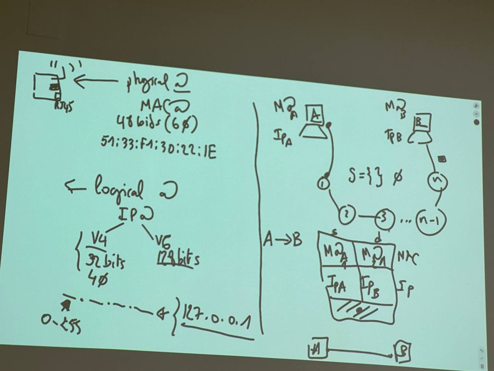

## Networks and Networks Topology:
* A computer network is a set of nodes connected to each other via communication links and packet switching 

* The network topology refers to the architecture of how nodes are connected to each others
* Here are some examples of network topology:

## Some terminals (hosts):
* A server is a network computer that runs a service, it could be a database server, a web server, a DHCP server... 
* DNS allows you to resolve domain names to IP addresses and vice versa
* The server which is responsible for assigning unique IP addresses to the network nodes within the same network is called the **DHCP server**
* Other types of servers:
  * DB server
  * SSH server (the software that listens for ssh client, usually on port 22)
  * Telnet server 
  * Web servers
  * File servers 
  * DHCP servers 
  
## The non terminals (network devices):
### The hub:
* Hubs are low level devices that just duplicate the signals they receive, they duplicate electrical signals over all the links connected to them. Hubs **cannot** read mac addresses

### The hub:
* Switches connect devices in the same LAN. Hubs can read mac addresses and remember which mac addresses correspond to which port in the switch

### The hub:
* Routers have two types:
  * ROUTERS
  * SOHO ROUTER (Snall Office Home Office)

### The router:
* The router is a powerful computer that performs routing, it allows the connection of networks with each others and routs the data packets between the connected networks
* The router keeps a DS that contains which tell the router where should the next node be, not necessarily the destination 

### Modem:
* Modem comes from modulation/ demodulation, meaning that the model does both modulation and demodulation
* Demo does Demodulation only
* You have an antenna that points to the satellites to receive the signals, the signals are received by the antenna, goes through cables which lead to the demo
* Modulation: 
* Modulation is used if we want the signals to go further, the data being sent are being added inside another signal called the carrier
* Modulation is basically the process of taking data/signal and putting it inside a carrier, so that it can travel for further distances
* Demodulation refers to the process of extracting the data/signal from the received signals by removing the carrier
* The modem has to do both modulation and demodulation because it sends data packets and receive it
* The modem we have in our houses has two types of ports 
  * The register Jack 45 -> Ethernet (Fiber optical)
  * The Register Jack 11 -> telephone line (ADSL)
* What is a carrier?
* It is a signal that has different frequencies in the amplitude
* If you add signals to each others, you can travel and then you can demodulate by knowing the carrier, so you just subtract it from the signal to get the data
* There are different types of modulation:
  * Frequency Modulation
  * AMplitude modulation
  * phase modulation
  
### Access Points:
* An access point is any device which allows you to access the network, it could be a switch, a hub, an antenna ...
* There are two types of access points:
  * Wired: switch, hub
  * Wireless: antenna
  
### Firewall:
* Firewall came from the time when physical security was one of the major techniques to ensure security
* Firewall prevents damage (attackers/activities) from spreading from one place to another
* It can be a physical device or software 
* It acts as a barrier monitoring and blocking traffic, to control it (whether data packet)
  

### Gateway:
* Gateway the last device before you go to the internet (the gate to go to the internet)
* It is the device to connect two types of networks because the packets exchanged in one type of networks is different from those exchanged in other types of networks, for example, the 4G networks frames are not like the ethernet frames, and so on
* So the gateway will convert data packets from one format to another
* Now, they are connected to the IP network

### Forward proxy and Reverse proxy:
* Non terminals:
  * Router 
    * ROUTER

    * SOHO router
  * Switch
  * Hub

### Connecting user computers to switches:
* Computers connect to switches by ports in a wired way, it could be Rj 45
* Computers connect to the internet wirelessly through a network interface, which we denote as NIC, network adapters
* The air has many frequencies, for example you cannot hear the sound of the mosketo
* You need a device that is configured on a specific frequency so that it can demodulate signals
* The ear can be considered as demodulator
* The air has many bands (groups of frequencies)
* A band for military, a band for radio, a band for 4G, a band for wifi....
* Wifi has two bands
  * 2.4 GHz -> most of us use it 
  * 5GHz -> available 
* Network cards can be dual band, quadro band ...

### What is an antenna
* An antenna consists of a metalic wire
* when a signal is being transmitted over the antenna, it will traverse the metalic wire of the antenna as an electrical wave, it will then be converted to an electro magentic waves and vice versa when electromagnetic waves are being captured by the antenna
* There are patch antennas which are used in our laptops, we cannot see them 

* packets contain data, data contain inforamtion 

* When the manufacturer produces a network card, be it wifi (stick based antenna), or patch antenna (like the usb one), or RJ 45, they assign to this network card a unique number, called the mac address, it is a 48-bit addresses, or 6 bytes

* When connecting the network interface to a network, it is assigned a logical address (IP address)
* It has two versions:
  * IPv4 (32-bits) (0-255.0-255.0-255.0-255)
  * IPv6 (128-bits)
* 127.0.0.1 -> localhost
* why do we need two names (two addresses)?
* we can absolutely use mac addresses instead of IP addresses, but would it be feasible?
* when it comes to point-to-point(computer to computer) communication, we use mac addresses (in the same LAN, we don't need IP addresses, loopback address)
* when it comes to end-to-end(service to program, program to service, program to program, service to service) communication, we use IP addresses

## Layers:

* The OSI model has been designed to implement things from
* From the OSI model, we have implemented the TCP/IP suite or the TCP/IP suite
* A part of the data link, the network, the transport and the applications consider the Operating system
* At the data link, we have the drivers
* The layers add headers to the data being sent
* It is at the transport layer, that we add port numbers
* When the data frame reaches the physical layer, they will be either transmitted as electromagnetic wave (wirelessly) or as electrical signals (fiber optic cables)
* Two programs in the same computer do not need to go through the network card (inter-process communication does not need to go through the NIC)
* localhost is called loopback because it goes back in the network layer
* loopback represents a virtual network interface, it does not have a mac address because it does not need to reach the layer 2
* 
* Modulation means taking data and putting it in the carrier(allow you to reach far distances) (data + carrier) 
* The demodulation is the process of removing the data from the carrier 
* The access point is a device which allows you to access the net 
  * They can be wired (switch, router...)
  * Or wireless (antenna), it can create wireless network an
* Firewalls prevent attackers and malicioius traffic from accessing ur network
* It is a barrier which checks 
* They monitor the traffic to control it
* Gateway connects two different types of networks, it changes the packets fromats from one format to another
* Modulation has different types:
  * AM 
  * Frequency 

* Network NIC 
* Network RJ45

* We need a device that is configured on certain frequencies 
* NIC can be uni band or dual band 
* what is an antenna?
  * it constitues of a metal cable
  * electromagnitic waves (air)  generates -> electronic signals
* Patch antenna (you cannot see it)

* a Mac address is 6 bytes value or 48 bits
* IPv4 is 32 bits i.e 4 bytes
* IPv6 is 128 bits 
* why do we need two types of addresses? => 
* Mac address is used to send point to point
* Ip is for end-to-end communication always (service to service, program to program, service to program, program to service)

## Layers
* The TCP/IP suite or stack has been implemented from the OSI model
* From the model we implement things
* Application layers include the network applications that need to access the internet 
* The header is a service provided to you and the other layers
* electromagetic waves/electrical signals in the physical layer
* We use the network card only when we want to get out
* we use inter-process commnunication to connect 2 process with each others when they are in the same OS

ADSL