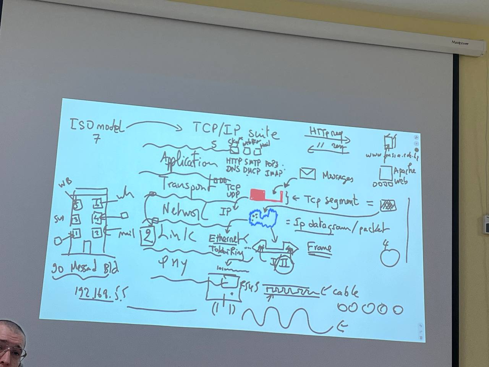
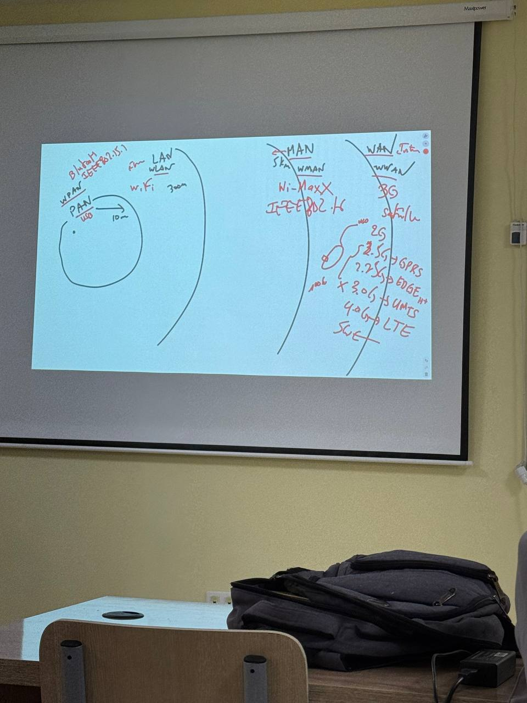
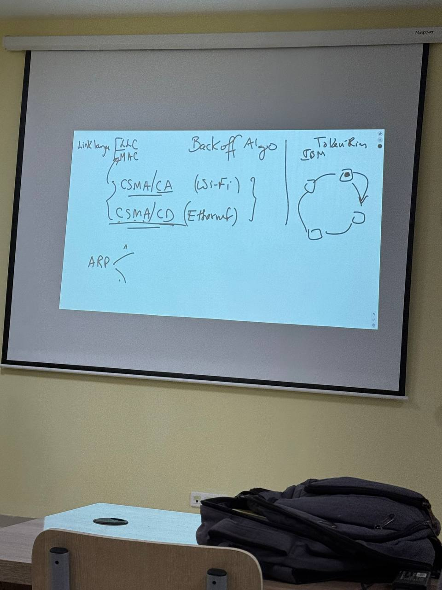

* From the layer 2, i.e, data link, we start talking about frames
* Ethernet is a protocol of the second layer 
* cross-layer communication refers to the ability of the protocols to access different layers across the TCP/IP suite
* Some application layer protocols: HTTP, SMTP,POP3, DNS, DHCP, IMAP
* At the application layer, packets are called messages
* The message (data) is given as a **payload** to the lower layers
* The TCP layer assigns a port number to each message sent to the layers on the bottom
* Ports are defined in the Transport layer

* Message + TCP header is called the TCP segment 
* The Network layer takes the payload obtained from the layer 4 and adds to it the IP header to produce the IP datagram
* There are ehternet 1 and ethernet 2, they have the same format
* But the difference is in modulation of the signals and the category of the cables

* PAN (Personal Area Network) IEEE 802.15.1
* WPAN (Bleutooth) wireless , wired: usb
* LAN
* WLAN (wi-fi)
* Metropolotic AN IEEE 802.16, exp include WiMax
* WMAN (Wireless MAN)

* Link layer has two layers:
  * LLC 
  * MAC
* The driver is installed in the link layer
* MAC has two systems:
  * CSMA/Collision Avoidance -> wireless 'wi-fi'
  * CSMA/CD -> Ethernet (wired)

* Bothr 

preamble is added at the physical layer

* The ARP packet has two codes:
  * 1: request 
    * Prob (who has __ tells ___)
    * Announcement (they changed their IP address and wanted to announce)
    * Gratitutious (to check whether the other nodes have the same IP @s as you detected that someone else is using your IP address )
  * 2